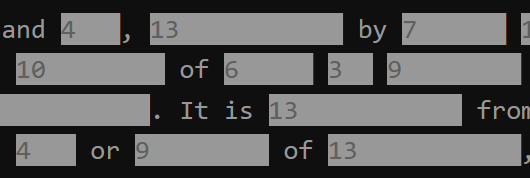

# redactle-utils
Tools to make Redactle even more fun

## showLetterCounts.user.js

This is a userscript to display the letter counts of each redacted word and
of the word being guessed.

### How to install

**Option 1**

Install from [Greasy Fork](https://greasyfork.org/en/scripts/445440-showlettercounts).

**Option 2**
1. Install [Tampermonkey](https://www.tampermonkey.net/)
2. Click the Tampermonkey icon to open it
3. Choose _Create a new script..._
4. Paste in the code from the file `showLetterCounts.user.js`, completely replacing the template code
5. Save the script: _Editor > File > Save_

### How to use
1. Open https://www.redactle.com/
2. When the page has finished loading, put your mouse pointer over the page and right-click
3. Choose _Tampermonkey > showLetterCounts_ from the context menu

The letter counts should appear in the redacted words, like this

The letter count for the guess you are typing in is displayed to the right of the input field. (Code is from this [Reddit message](https://www.reddit.com/r/Redactle/comments/uui6kg/redactle_count_display)).
